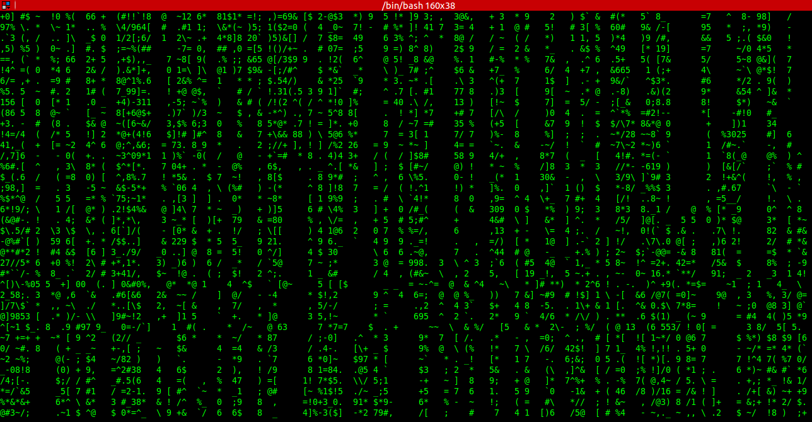

short-fun-projects
==================

Here, I share any short code projects I learn, which intuitive and cool.

1) matrix.cpp 
   - Generates a matrix like terminal screen using C++ threads
   - Please use "Green on Black" terminal settings to view it.
   - Used winsize + ioctl to detect terminal window size, instead of using a constant.

