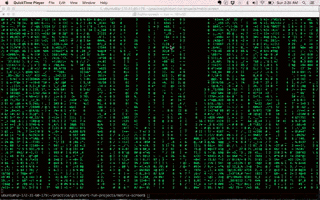

short-fun-projects
==================

Here, I share any short code projects I learn, which intuitive and cool.

##Hangman

## Matrix screen 
   - Generates a matrix like terminal screen using C++ threads
   - Please use "Green on Black" terminal settings to view it.
   - Used winsize + ioctl to detect terminal window size, instead of using a constant.

## Coin Flip Simulation 
   - A simple coin flip simulation using C++11 random library

## Decimal to Binary, Binary to Decimal conversion
   - A simple conversion program, which can convert large decimal binary conversions.
    
## Text Games
   - Computer try to guess the number you chose.
   - You guess the random number computer chooses.
